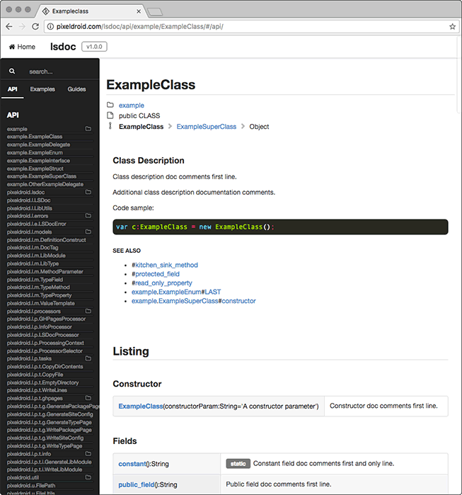

# lsdoc

an API docs generator for LoomScript

**lsdoc** provides an API for loading loomlib libraries and extracting type metadata. The distribution provides a command line tool and GitHub Pages Jekyll template for creating html documentation that is:
* searchable
* browsable
* cross-linked
* mobile friendly

> see **lsdoc** api documentation documented by **lsdoc** here: https://pixeldroid.github.io/lsdoc/

 

- [installation](#installation)
- [usage](#usage)
- [building](#building)
- [contributing](#contributing)

## installation

> requires [Rake][rake]

Clone this repo.

0. Run `rake cli:install` to:
    * install the `ghpages-template` from this project into the default sdk directory (see `~/.loom/loom.config`)
    * build and install the `lsdoc` executable onto the system (`/Users/<user>/bin/lsdoc`)
0. Run `rake cli:uninstall` to:
    * delete the `ghpages-template` directory from the default sdk directory
    * remove the `lsdoc` executable from the system

## usage

directly from the command line:

    $ lsdoc --help

from any Loom project using [loomtasks][loomtasks] (including this one):

    $ rake docs

the **lsdoc** loomlib can also be linked into your own Loom project to leverage the [lsdoc API][lsdoc-api] and build your own documentation tool.

## building

first, install [loomtasks][loomtasks] and [bundler][bundler].

then run `bundle install` to retrieve and install the project dependencies on [Jekyll][jekyll] and the [GitHub Pages gem][ghpages-gem]

### compiling from source and installing for use

    $ rake cli:install

this will build the lsdoc library, install it and the ghpages-template in the currently configured sdk, build the command line tool and install it on the path

### running tests

    $ rake test

this will build the lsdoc library, install it in the currently configured sdk, build the test app, and run the test app.

### starting jekyll
> from the project root

    $ bundle exec jekyll serve --watch --source docs/ --destination docs/_site

### running the demo
> from the project root, before installed on the system

    $ export LSDOC=`pwd`
    $ export LSDK="$HOME/.loom/sdks/sprint34"
    $ rake clean && rake cli['-p ghpages -t $LSDK/ghpages-template -l $LSDK/libs/LSDoc.loomlib -o $LSDOC/docs -c $LSDOC/doc/lsdoc.config -i $LSDOC/doc/index.md -e $LSDOC/doc/examples -g $LSDOC/doc/guides']

after tested and installed, invoke in the usual manner:

    $ lsdoc <args>

## contributing

Pull requests are welcome!

[bundler]: http://bundler.io "Manage your Ruby application's gem dependencies"
[ghpages-gem]: https://github.com/github/pages-gem "A simple Ruby Gem to bootstrap dependencies for setting up and maintaining a local Jekyll environment in sync with GitHub Pages"
[jekyll]: https://jekyllrb.com/ "Jekyll is a blog-aware, static site generator in Ruby"
[loomtasks]: https://github.com/pixeldroid/loomtasks "Rake tasks for working with loomlibs"
[lsdoc-api]: https://pixeldroid.github.io/lsdoc/ "API docs for lsdoc"
[rake]: https://github.com/ruby/rake "A make-like build utility for Ruby"
